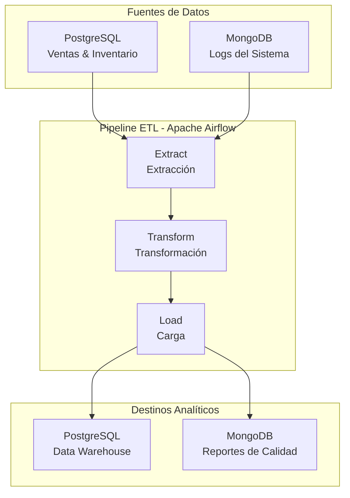

# 🏭 Pipeline ETL Metaltronic S.A.

**Pipeline de datos para empresa metalmecánica ecuatoriana**

[](https://www.python.org/downloads/)
[](https://www.docker.com/)
[](https://airflow.apache.org/)
[](https://www.postgresql.org/)
[](https://www.mongodb.com/)

## 📋 Descripción del Proyecto

Sistema ETL (Extract, Transform, Load) desarrollado para **Metaltronic S.A.**, empresa metalmecánica ubicada en Ambato, Tungurahua, Ecuador. El pipeline procesa diariamente datos de ventas, inventario y logs operacionales para generar insights de negocio.

### 🎯 Objetivo
Automatizar el procesamiento de datos transaccionales y generar reportes analíticos que permitan:
- Monitorear el desempeño de ventas diarias
- Optimizar la gestión de inventario
- Analizar patrones de comportamiento del sistema

## 🏗️ Arquitectura del Sistema



## 🛠️ Stack Tecnológico

### Lenguajes y Frameworks
- **Python 3.9+**: Lenguaje principal para ETL
- **SQL**: Consultas y modelado de datos
- **Pandas**: Manipulación y análisis de datos
- **SQLAlchemy**: ORM para bases de datos relacionales

### Bases de Datos
- **PostgreSQL 13**: Base de datos transaccional y data warehouse
- **MongoDB 5.0**: Almacenamiento de logs y documentos no estructurados

### Herramientas ETL y Orquestación
- **Apache Airflow 2.7**: Orquestación del pipeline
- **Docker & Docker Compose**: Containerización y despliegue

### Plataformas Cloud (Simuladas Localmente)
- **Almacenamiento**: Simulación de AWS S3 con volúmenes Docker
- **Procesamiento**: Contenedores que simulan servicios cloud

## 📁 Estructura del Proyecto

```
metaltronic-data-pipeline/
├── 📄 README.md                    # Documentación principal
├── 📄 docker-compose.yml           # Configuración de contenedores
├── 📄 Dockerfile                   # Imagen personalizada Airflow
├── 📄 requirements.txt             # Dependencias Python
├── 📄 .env                        # Variables de entorno
├── 📄 .gitignore                  # Archivos ignorados por Git
├── 📂 sql/
│   ├── 📄 init_postgres.sql       # Datos iniciales PostgreSQL
│   └── 📄 init_mongo.js           # Datos iniciales MongoDB
├── 📂 dags/
│   └── 📄 metaltronic_etl_dag.py  # DAG principal de Airflow
├── 📂 src/
│   ├── 📄 __init__.py
│   ├── 📄 extract.py              # Módulo de extracción
│   ├── 📄 transform.py            # Módulo de transformación
│   └── 📄 load.py                 # Módulo de carga
├── 📂 config/
│   └── 📄 database.py             # Configuración de conexiones
└── 📂 data/
    ├── 📂 raw/                    # Datos sin procesar
    └── 📂 processed/              # Datos transformados
```

## 🚀 Instalación y Configuración

### Prerrequisitos
- Docker Desktop 4.0+ instalado
- Git para clonar el repositorio
- 8GB RAM disponible (recomendado)
- Puertos disponibles: 5432, 27017, 8080, 6379

### 1. Clonar el Repositorio
```bash
git clone https://github.com/tu-usuario/metaltronic-data-pipeline.git
cd metaltronic-data-pipeline
```

### 2. Configurar Variables de Entorno
```bash
# El archivo .env ya está incluido con valores por defecto
# Opcional: personalizar credenciales si es necesario
cp .env .env.local
```

### 3. Construir y Ejecutar los Contenedores
```bash
# Construir las imágenes
docker-compose build

# Ejecutar en segundo plano
docker-compose up -d

# Verificar que todos los servicios estén corriendo
docker-compose ps
```

### 4. Verificar la Instalación
```bash
# Verificar logs de Airflow
docker-compose logs airflow-webserver

# Verificar conexión a PostgreSQL
docker-compose exec postgres psql -U metaltronic_user -d metaltronic_db -c "\dt ventas.*"

# Verificar conexión a MongoDB
docker-compose exec mongodb mongo -u mongo_user -p mongo_pass --authenticationDatabase admin
```

## 🎮 Uso del Sistema

### Acceso a la Interfaz Web de Airflow
1. Abrir navegador en: http://localhost:8080
2. **Usuario**: `admin`
3. **Contraseña**: `admin123`

### Ejecutar el Pipeline ETL

#### Ejecución Manual
1. En la interfaz de Airflow, buscar el DAG: `metaltronic_etl_pipeline`
2. Activar el DAG con el toggle
3. Hacer clic en "Trigger DAG" para ejecutar manualmente

#### Ejecución Programada
- El pipeline se ejecuta automáticamente todos los días a las 6:00 AM
- Procesa los datos del día anterior

### Monitorear la Ejecución
```bash
# Ver logs del pipeline
docker-compose logs -f airflow-scheduler

# Ver logs específicos de una tarea
docker-compose exec airflow-webserver airflow tasks log metaltronic_etl_pipeline extract_data 2024-01-15
```

## 🧪 Pruebas y Validación

### 1. Verificar Datos de Origen
```sql
-- Conectar a PostgreSQL
docker-compose exec postgres psql -U metaltronic_user -d metaltronic_db

-- Verificar datos de ventas
SELECT COUNT(*) FROM ventas.transacciones;
SELECT COUNT(*) FROM ventas.detalle_ventas;
SELECT COUNT(*) FROM inventario.productos;
```

```javascript
// Conectar a MongoDB
docker-compose exec mongodb mongo -u mongo_user -p mongo_pass --authenticationDatabase admin

use metaltronic_mongo
db.logs_ventas.count()
db.sesiones_usuario.count()
```

### 2. Ejecutar Pipeline Completo
```bash
# Ejecutar DAG específico para una fecha
docker-compose exec airflow-webserver airflow dags trigger metaltronic_etl_pipeline

# Monitorear estado
docker-compose exec airflow-webserver airflow dags state metaltronic_etl_pipeline 2024-01-15
```

### 3. Validar Resultados
```sql
-- Verificar datos procesados en PostgreSQL
SELECT * FROM analytics.resumen_ventas_diario ORDER BY fecha_resumen DESC LIMIT 5;
SELECT * FROM analytics.analisis_inventario WHERE performance = 'Alto' LIMIT 10;
```

### 4. Casos de Prueba
- ✅ **Extracción**: Verificar que se extraigan datos de ambas fuentes
- ✅ **Transformación**: Validar cálculos de métricas de negocio
- ✅ **Carga**: Confirmar inserción en tablas de destino
- ✅ **Calidad**: Revisar reportes de calidad de datos

## 📊 Datos y Métricas Generadas

### Resumen Diario de Ventas
- Total de ventas por día
- Número de transacciones
- Productos más vendidos
- Clientes más frecuentes
- Promedio de ticket de compra

### Análisis de Inventario
- Rotación de inventario por producto
- Días de stock disponible
- Productos con bajo stock
- Performance de ventas por categoría

### Reportes de Calidad
- Completitud de datos
- Valores duplicados
- Métricas de procesamiento
- Logs de errores y advertencias

## 🔧 Comandos Útiles

### Gestión de Contenedores
```bash
# Detener todos los servicios
docker-compose down

# Reiniciar un servicio específico
docker-compose restart airflow-webserver

# Ver logs en tiempo real
docker-compose logs -f [nombre-servicio]

# Limpiar volúmenes (CUIDADO: borra todos los datos)
docker-compose down -v
```

### Gestión de Airflow
```bash
# Reiniciar el scheduler
docker-compose exec airflow-scheduler airflow scheduler

# Listar DAGs
docker-compose exec airflow-webserver airflow dags list

# Pausar/despausar un DAG
docker-compose exec airflow-webserver airflow dags pause metaltronic_etl_pipeline
docker-compose exec airflow-webserver airflow dags unpause metaltronic_etl_pipeline
```

### Acceso a Bases de Datos
```bash
# PostgreSQL
docker-compose exec postgres psql -U metaltronic_user -d metaltronic_db

# MongoDB
docker-compose exec mongodb mongo -u mongo_user -p mongo_pass --authenticationDatabase admin
```

## 🐛 Solución de Problemas

### Problemas Comunes

#### Error: Puerto ya en uso
```bash
# Verificar puertos ocupados
netstat -tulpn | grep :8080
# Cambiar puerto en docker-compose.yml o liberar puerto
```

#### Error: Falta de memoria
```bash
# Verificar uso de memoria
docker stats
# Incrementar memoria de Docker Desktop
```

#### Error: Conexión a base de datos
```bash
# Verificar estado de contenedores
docker-compose ps
# Revisar logs de la base de datos
docker-compose logs postgres
docker-compose logs mongodb
```

### Logs de Depuración
```bash
# Logs detallados de Airflow
docker-compose exec airflow-webserver airflow config list
docker-compose logs airflow-webserver | grep ERROR

# Logs de pipeline
tail -f data/processed/*.log
```

## 🚦 Monitoreo y Alertas

### Métricas Clave
- ⏱️ **Tiempo de ejecución**: < 15 minutos por pipeline completo
- 📊 **Tasa de éxito**: > 95% de ejecuciones exitosas
- 💾 **Volumen de datos**: ~1000-5000 registros diarios
- 🔄 **Frecuencia**: Ejecución diaria automática

### Alertas Configuradas
- ❌ Falla en extracción de datos
- ⚠️ Datos faltantes o inconsistentes
- 🕐 Pipeline tardando más de 30 minutos
- 💾 Espacio en disco bajo (< 2GB disponible)

## 👥 Contribución y Desarrollo

### Configuración de Desarrollo
```bash
# Clonar y configurar entorno de desarrollo
git clone [repo-url]
cd metaltronic-data-pipeline

# Crear rama de desarrollo
git checkout -b feature/nueva-funcionalidad

# Instalar dependencias locales (opcional)
pip install -r requirements.txt
```

### Convenciones de Código
- **Python**: Seguir PEP 8
- **SQL**: Usar UPPERCASE para palabras clave
- **Git**: Commits descriptivos en español
- **Documentación**: Comentarios en español

### Testing
```bash
# Ejecutar tests unitarios (cuando estén disponibles)
pytest tests/

# Validar sintaxis SQL
docker-compose exec postgres psql -U metaltronic_user -d metaltronic_db -f sql/test_queries.sql
```

## 📜 Licencia y Contacto

### Empresa
**Metaltronic S.A.**
- 📍 Ambato, Tungurahua, Ecuador
- 📧 info@metaltronic.com
- 🌐 www.metaltronic.com.ec

### Equipo de Desarrollo
- **Data Engineering Team**
- 📧 data@metaltronic.com
- 🐛 Issues: [GitHub Issues](https://github.com/tu-usuario/metaltronic-data-pipeline/issues)

### Licencia
Este proyecto está bajo la Licencia MIT. Ver archivo `LICENSE` para más detalles.

---

**⚡ ¡Pipeline listo para procesar datos metalmecánicos ecuatorianos!**

*Desarrollado con ❤️ por el equipo de Ingeniería de Datos de Metaltronic S.A.*
